# devops

[devops](http://180.173.34.78:8007/) a plateform for cmdb, saltstack, zabbix and systemlog

#### 已完成模块

>一、 账户管理

>> 1. 用户管理

>> 2. 用户组管理

>二、权限管理

>> 1. 权限列表

>> 2. 角色管理

>三、资产管理

>> 1. 模型管理 -- 可以自定义模型属性

>> 2. 实例列表

>四、作业平台（基于saltstack开发）

>> 1. 命令执行 -- 批量执行命令

>> 2. 文件分发 -- 批量向远端分发文件

>> 3. 脚本管理 -- 批量执行脚本

>> 4. 模块部署 -- 复杂任务通过saltstack模块部署

>> 5. 定时任务 -- 定时执行命令或脚本（类似cron）

>> 6. 操作记录 -- 以上操作的均会记录，方便查询

#### Preview

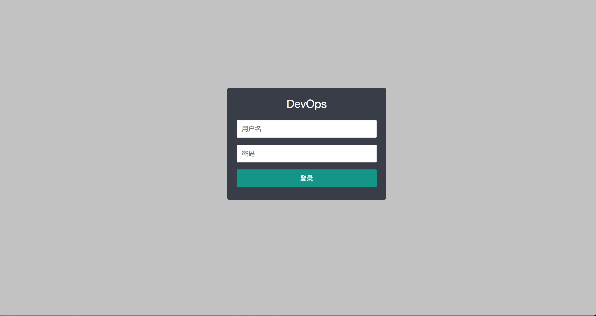

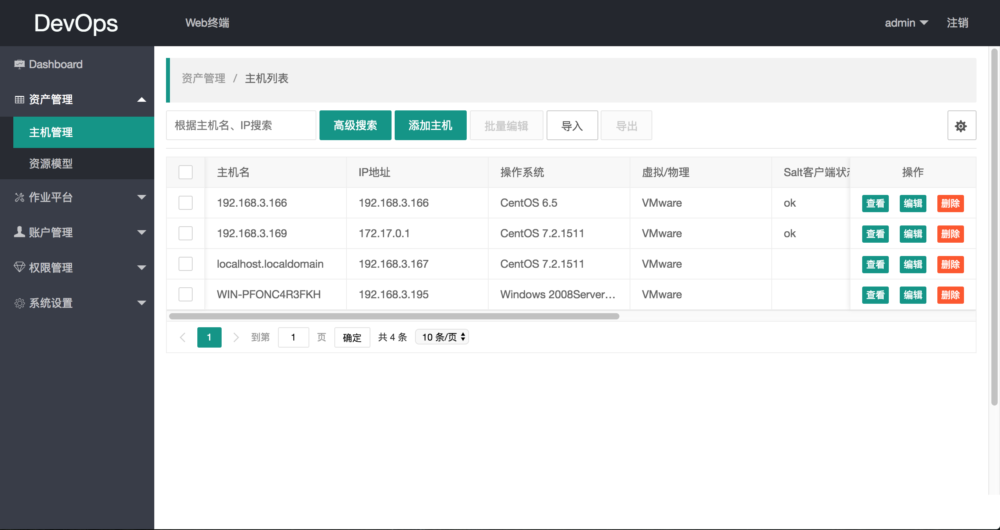

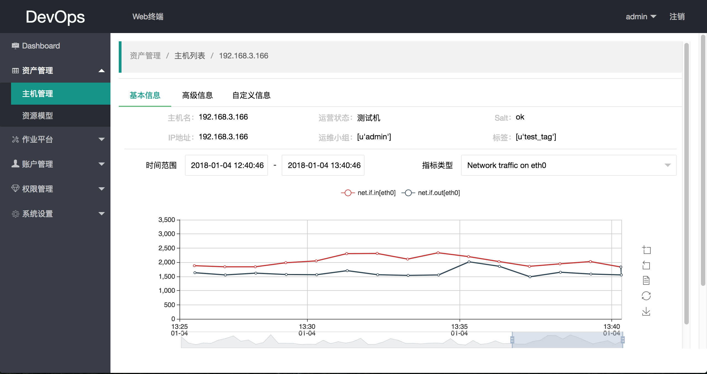

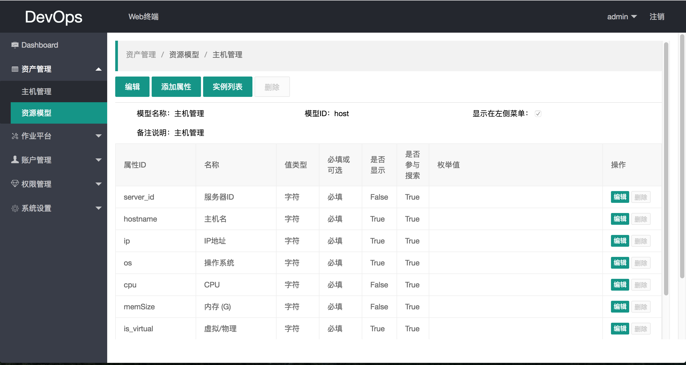

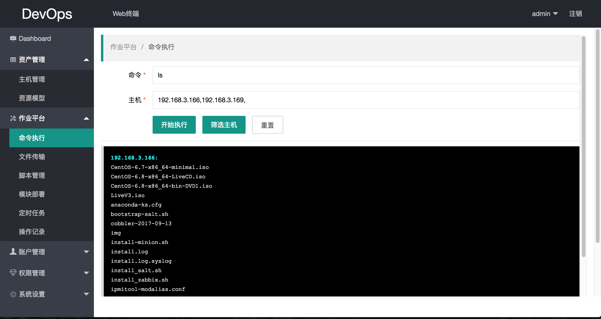

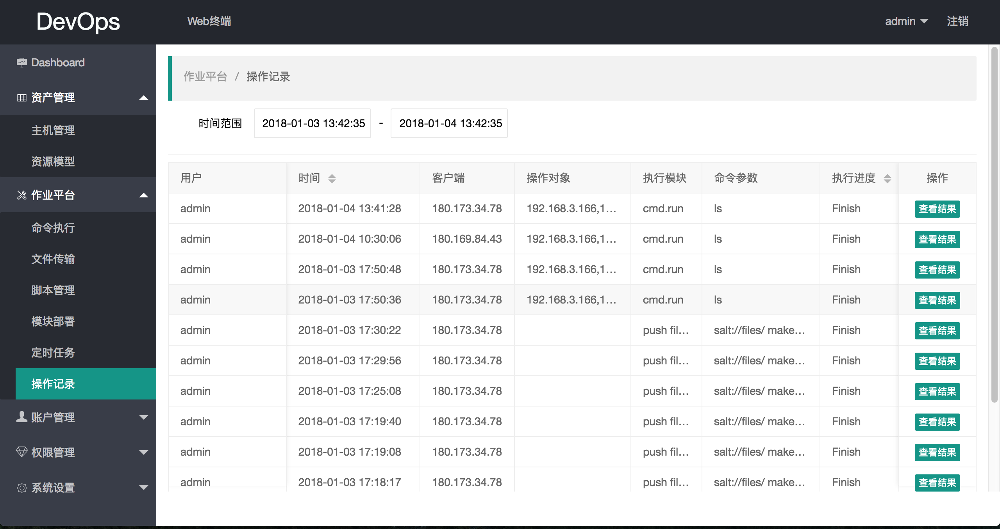

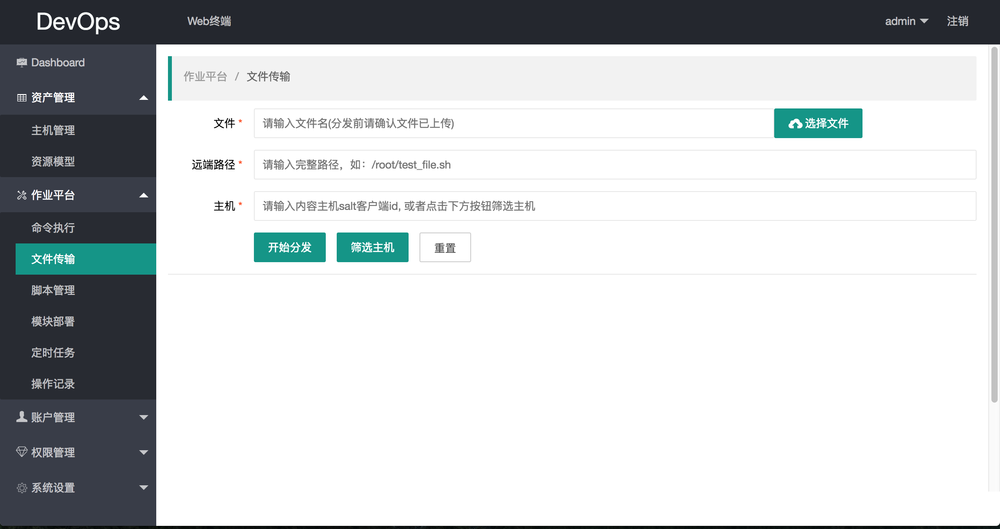

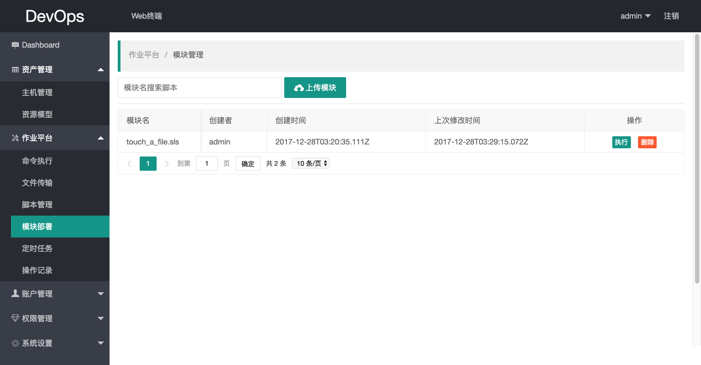

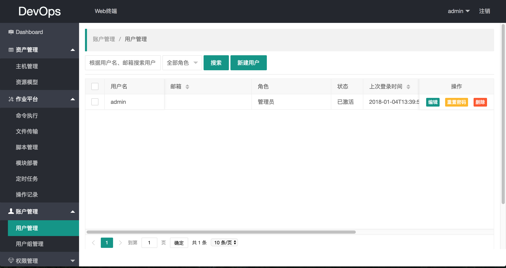

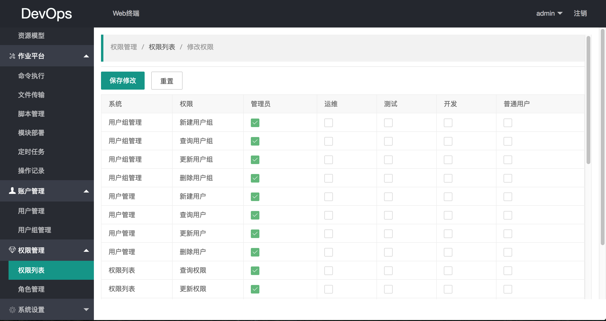

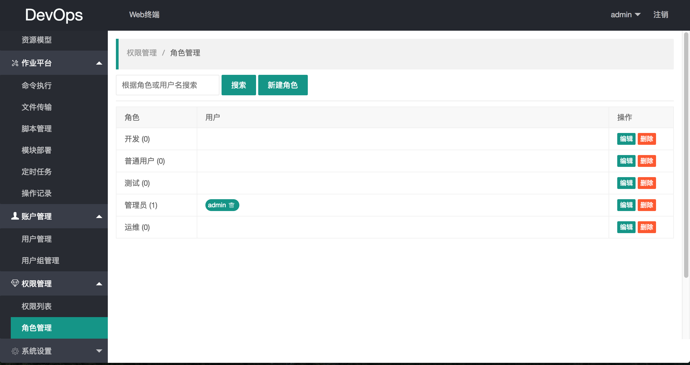

#### 部署

目前针对现有功能，已经封装成一个虚拟机(vmware平台)，如要体验，请[下载](https://pan.baidu.com/s/1jJDgg66)虚拟机，并参考[配置文档](https://github.com/uevol/devops/blob/master/docs/deploy/config_for_vm.md)进行配置。

部署及配置详细文档请[阅读相关文档](https://github.com/uevol/devops/tree/master/docs)

#### License

    The MIT License (MIT)

    Copyright (c) 2018 uevol

    Permission is hereby granted, free of charge, to any person obtaining a copy
    of this software and associated documentation files (the "Software"), to deal
    in the Software without restriction, including without limitation the rights
    to use, copy, modify, merge, publish, distribute, sublicense, and/or sell
    copies of the Software, and to permit persons to whom the Software is
    furnished to do so, subject to the following conditions:

    The above copyright notice and this permission notice shall be included in all
    copies or substantial portions of the Software.

#### Author
    
    1. feng.tang@jinmuinfo.com

    2. wei.yang@jinmuinfo.com

#### Company

    上海锦木信息技术有限公司